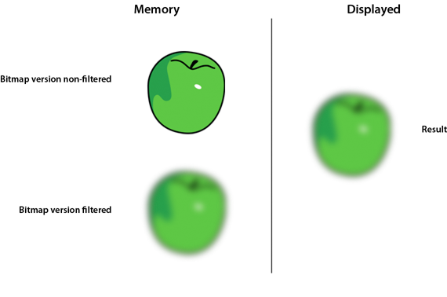

# Filters and dynamic bitmap unloading

>  Avoid filters, including filters processed through
> Pixel Bender.

Try to minimize the use of effects like filters, including filters processed in
mobile devices through Pixel Bender. When a filter is applied to a display
object, the runtime creates two bitmaps in memory. The first is created as a
rasterized version of the display object, which in turn is used to produce a
second bitmap with the filter applied:

 Two bitmaps in memory when
filter is applied

Modifying one of the properties of a filter involves some CPU processing and can
use a significant amount of memory.

> **Note:** The bitmaps are not of the same size. Certain filters create images
> that are larger than the original image, as the kernel in many filters exceeds
> the bounds of the source image and produces an output that is larger than the
> original image.

Flash Player 10.1 and AIR 2.5 introduce a new filtering behavior on all
platforms. If the filter is not modified within 30 seconds, or if it is hidden
or offscreen, the memory used by the non-filtered bitmap is freed. This feature
saves half the memory used by a filter on all platforms. For example, consider a
text object with a blur filter applied. The text in this case is used for simple
decoration and is not modified. After 30 seconds, the non-filtered bitmap in
memory is freed. The same result occurs if the text is hidden for 30 seconds or
is offscreen. When one of the filter properties is modified, the non-filtered
bitmap in memory is recreated. This feature is called dynamic bitmap unloading.
Even with these optimizations, be cautious with filters; they still require
extensive CPU or GPU processing when being modified.

As a best practice, use bitmaps created through an authoring tool, such as
Adobe® Photoshop®, to emulate filters when possible. Avoid using dynamic bitmaps
created at runtime in ActionScript. Using externally authored bitmaps helps the
runtime to reduce the CPU or GPU load, especially when the filter properties do
not change over time. If possible, create any effects that you need on a bitmap
in an authoring tool. You can then display the bitmap in the runtime without
performing any processing on it, which can be much faster.
