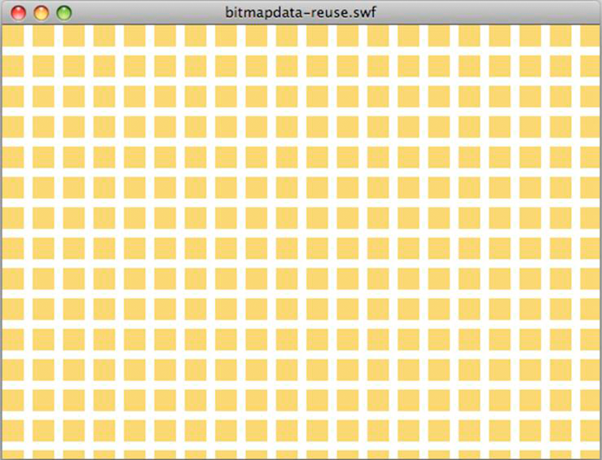
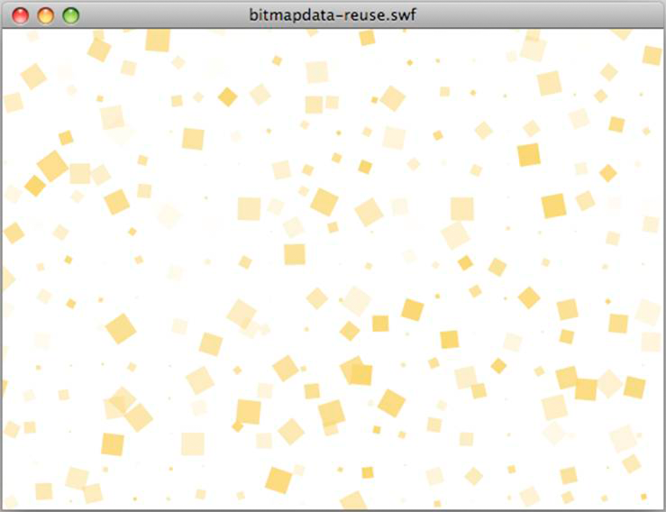

# Reusing objects

 Reuse objects, when possible, instead of recreating
them. Another simple way to optimize memory is to reuse objects and avoid
recreating them whenever possible. For example, in a loop, do not use the
following code:

    const MAX_NUM:int = 18;
    const COLOR:uint = 0xCCCCCC;

    var area:Rectangle;

    for (var:int = 0; i < MAX_NUM; i++)
    {
        // Do not use the following code
        area = new Rectangle(i,0,1,10);
        myBitmapData.fillRect(area,COLOR);
    }

Recreating the Rectangle object in each loop iteration uses more memory and is
slower because a new object is created in each iteration. Use the following
approach:

    const MAX_NUM:int = 18;
    const COLOR:uint = 0xCCCCCC;

    // Create the rectangle outside the loop
    var area:Rectangle = new Rectangle(0,0,1,10);

    for (var:int = 0; i < MAX_NUM; i++)
    {
        area.x = i;
        myBitmapData.fillRect(area,COLOR);
    }

The previous example used an object with a relatively small memory impact. The
next example demonstrates larger memory savings by reusing a BitmapData object.
The following code to create a tiling effect wastes memory:

    var myImage:BitmapData;
    var myContainer:Bitmap;
    const MAX_NUM:int = 300;
     
    for (var i:int = 0; i< MAX_NUM; i++)
    {
        // Create a 20 x 20 pixel bitmap, non-transparent
        myImage = new BitmapData(20,20,false,0xF0D062);
         
        // Create a container for each BitmapData instance
        myContainer = new Bitmap(myImage);
         
        // Add it to the display list
        addChild(myContainer);
         
        // Place each container
        myContainer.x = (myContainer.width + 8) * Math.round(i % 20);
        myContainer.y = (myContainer.height + 8) * int(i / 20);
    }

Note: When using positive values, casting the rounded value to int is much
faster than using the `Math.floor()` method. The following image shows the
result of the bitmap tiling:

 Result of bitmap tiling

An optimized version creates a single BitmapData instance referenced by multiple
Bitmap instances and produces the same result:

    // Create a single 20 x 20 pixel bitmap, non-transparent
    var myImage:BitmapData = new BitmapData(20,20,false,0xF0D062);
    var myContainer:Bitmap;
    const MAX_NUM:int = 300;
     
    for (var i:int = 0; i< MAX_NUM; i++)
    {
        // Create a container referencing the BitmapData instance
        myContainer = new Bitmap(myImage);
         
        // Add it to the display list
        addChild(myContainer);
         
        // Place each container
        myContainer.x = (myContainer.width + 8) * Math.round(i % 20);
        myContainer.y = (myContainer.height + 8) * int(i / 20);
    }

This approach saves about 700 KB in memory, which is a significant savings on a
traditional mobile device. Each bitmap container can be manipulated without
altering the original BitmapData instance by using the Bitmap properties:

    // Create a single 20 x 20 pixel bitmap, non-transparent
    var myImage:BitmapData = new BitmapData(20,20,false,0xF0D062);
    var myContainer:Bitmap;
    const MAX_NUM:int = 300;
     
    for (var i:int = 0; i< MAX_NUM; i++)
    {
        // Create a container referencing the BitmapData instance
        myContainer = new Bitmap(myImage);
         
        // Add it to the DisplayList
        addChild(myContainer);
         
        // Place each container
        myContainer.x = (myContainer.width + 8) * Math.round(i % 20);
        myContainer.y = (myContainer.height + 8) * int(i / 20);
         
        // Set a specific rotation, alpha, and depth
        myContainer.rotation = Math.random()*360;
        myContainer.alpha = Math.random();
        myContainer.scaleX = myContainer.scaleY = Math.random();
    }

The following image shows the result of the bitmap transformations:

 Result of bitmap transformations

- [Object pooling](WS948100b6829bd5a6-19cd3c2412513c24bce-8000.html)

More Help topics

[Bitmap caching](WS4bebcd66a74275c36c11f3d612431904db9-7ffc.html)
