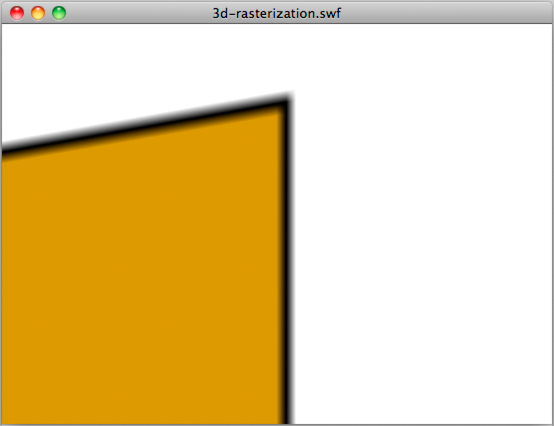

# Using 3D effects

>  Consider creating 3D effects manually.

Flash Player 10 and AIR 1.5 introduced a 3D engine, which allows you to apply
perspective transformation on display objects. You can apply these
transformations using the `rotationX` and `rotationY` properties or with the
`drawTriangles()` method of the Graphics class. You can also apply depth with
the `z` property. Keep in mind that each perspective-transformed display object
is rasterized as a bitmap and therefore requires more memory.

The following figure illustrates the anti-aliasing produced by the rasterization
when using perspective transformation:

 Anti-aliasing resulting
from perspective transformation

The anti-aliasing is a result of vector content being dynamically rasterized as
a bitmap. This anti-aliasing happens when you use 3D effects in the desktop
version of AIR and Flash Player, and in AIR 2.0.1 and AIR 2.5 for mobile.
However, anti-aliasing is not applied on Flash Player for mobile devices.

If you can create your 3D effect manually without relying on the native API,
that can reduce memory usage. However, the new 3D features introduced in Flash
Player 10 and AIR 1.5 make texture mapping easier, because of methods like
`drawTriangles()`, which handles texture mapping natively.

As a developer, decide whether the 3D effect you want to create provides better
performance if it is processed through the native API or manually. Consider
ActionScript execution and rendering performance, as well as memory usage.

In AIR 2.0.1 and AIR 2.5 mobile applications in which you set the `renderMode`
application property to `GPU`, the GPU does the 3D transformations. However, if
the `renderMode` is `CPU`, the CPU, not the GPU, performs the 3D
transformations. In Flash Player 10.1 applications, the CPU performs the 3D
transformations.

When the CPU does the 3D transformations, consider that applying any 3D
transformation to a display object requires two bitmaps in memory. One bitmap is
for the source bitmap, and a second one is for the perspective-transformed
version. In this way, 3D transformations work in a similar way to filters. As a
result, use the 3D properties sparingly when the CPU does the 3D
transformations.
