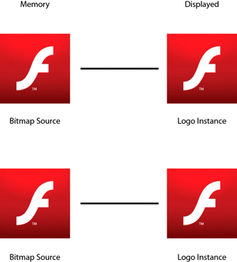
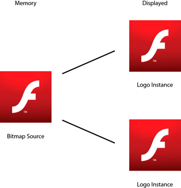
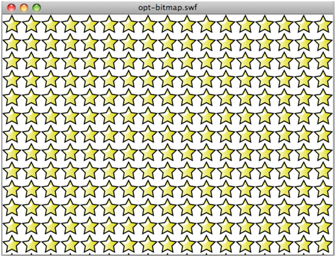
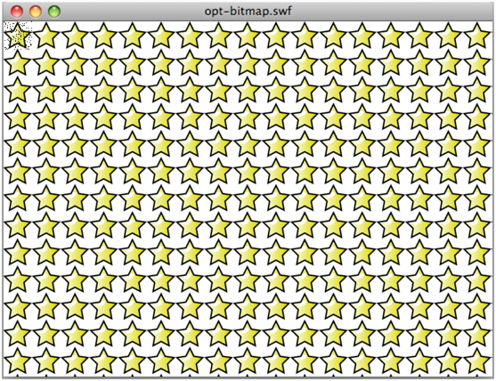
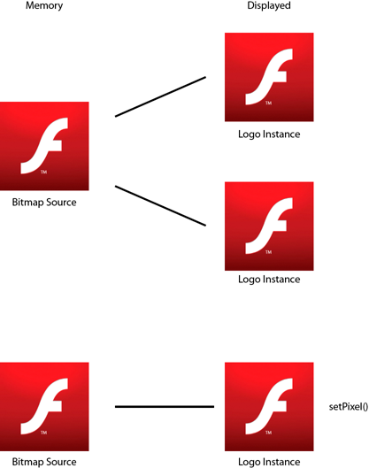
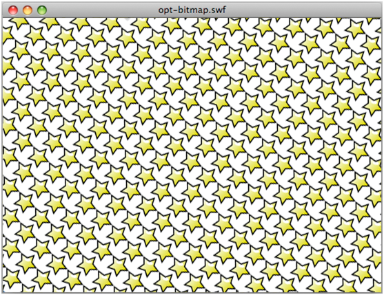

# BitmapData single reference

It is important to optimize the use of the BitmapData class by reusing instances
as much as possible. Flash Player 10.1 and AIR 2.5 introduce a new feature for
all platforms called BitmapData single reference. When creating BitmapData
instances from an embedded image, a single version of the bitmap is used for all
BitmapData instances. If a bitmap is modified later, it is given its own unique
bitmap in memory. The embedded image can be from the library or an \[Embed\]
tag.

> **Note:** Existing content also benefits from this new feature, because Flash
> Player 10.1 and AIR 2.5 automatically reuse bitmaps.

When instantiating an embedded image, an associated bitmap is created in memory.
Before Flash Player 10.1 and AIR 2.5, each instance was given a separate bitmap
in memory, as shown in the following diagram:

Bitmaps in memory before Flash Player 10.1 and AIR 2.5

In Flash Player 10.1 and AIR 2.5, when multiple instances of the same image are
created, a single version of the bitmap is used for all BitmapData instances.
The following diagram illustrates this concept:

Bitmaps in memory in Flash Player 10.1 and AIR 2.5

This approach dramatically reduces the amount of memory used by an application
with many bitmaps. The following code creates multiple instances of a `Star`
symbol:

    const MAX_NUM:int = 18;

    var star:BitmapData;
    var bitmap:Bitmap;

    for (var i:int = 0; i<MAX_NUM; i++)
    {
        for (var j:int = 0; j<MAX_NUM; j++)
        {
            star = new Star(0,0);
            bitmap = new Bitmap(star);
            bitmap.x = j * star.width;
            bitmap.y = i * star.height;
            addChild(bitmap)
        }
    }

The following image shows the result of the code:

Result of code to create multiple instances of symbol

With Flash Player 10, for example, the animation above uses about 1008 KB of
memory. With Flash Player 10.1, on the desktop and on a mobile device, the
animation uses only 4 KB.

The following code modifies one BitmapData instance:

    const MAX_NUM:int = 18;

    var star:BitmapData;
    var bitmap:Bitmap;

    for (var i:int = 0; i<MAX_NUM; i++)
    {
        for (var j:int = 0; j<MAX_NUM; j++)
        {
            star = new Star(0,0);
            bitmap = new Bitmap(star);
            bitmap.x = j * star.width;
            bitmap.y = i * star.height;
            addChild(bitmap)
        }
    }

    var ref:Bitmap = getChildAt(0) as Bitmap;

    ref.bitmapData.pixelDissolve(ref.bitmapData, ref.bitmapData.rect, new Point(0,0),Math.random()*200,Math.random()*200, 0x990000);

The following image shows the result of modifying one `Star` instance:

Result of modifying one instance

Internally, the runtime automatically assigns and creates a bitmap in memory to
handle the pixel modifications. When a method of the BitmapData class is called,
leading to pixel modifications, a new instance is created in memory, and no
other instances are updated. The following figure illustrates the concept:

Result in memory of modifying one bitmap

If one star is modified, a new copy is created in memory. The resulting
animation uses about 8 KB in memory on Flash Player 10.1 and AIR 2.5.

In the previous example, each bitmap is available individually for
transformation. To create only the tiling effect, the `beginBitmapFill()` method
is the most appropriate method:

    var container:Sprite = new Sprite();

    var source:BitmapData = new Star(0,0);

    // Fill the surface with the source BitmapData
    container.graphics.beginBitmapFill(source);
    container.graphics.drawRect(0,0,stage.stageWidth,stage.stageHeight);

    addChild(container);

This approach produces the same result with only a single BitmapData instance
created. To rotate the stars continuously, instead of accessing each Star
instance, use a Matrix object that is rotated on each frame. Pass this Matrix
object to the `beginBitmapFill()` method:

    var container:Sprite = new Sprite();

    container.addEventListener(Event.ENTER_FRAME, rotate);

    var source:BitmapData = new Star(0,0);
    var matrix:Matrix = new Matrix();

    addChild(container);

    var angle:Number = .01;

    function rotate(e:Event):void
    {
        // Rotate the stars
        matrix.rotate(angle);

        // Clear the content
        container.graphics.clear();
         
        // Fill the surface with the source BitmapData
        container.graphics.beginBitmapFill(source,matrix,true,true);
        container.graphics.drawRect(0,0,stage.stageWidth,stage.stageHeight);
    }

Using this technique, no ActionScript loop is required to create the effect. The
runtime does everything internally. The following image shows the result of
transforming the stars:

Result of rotating stars

With this approach, updating the original source BitmapData object automatically
updates its use elsewhere on the stage, which can be a powerful technique. This
approach would not, however, allow each star to be scaled individually, as in
the previous example.

> **Note:** When using multiple instances of the same image, drawing depends on
> whether a class is associated with the original bitmap in memory. If no class
> is associated with the bitmap, images are drawn as Shape objects with bitmap
> fills.
