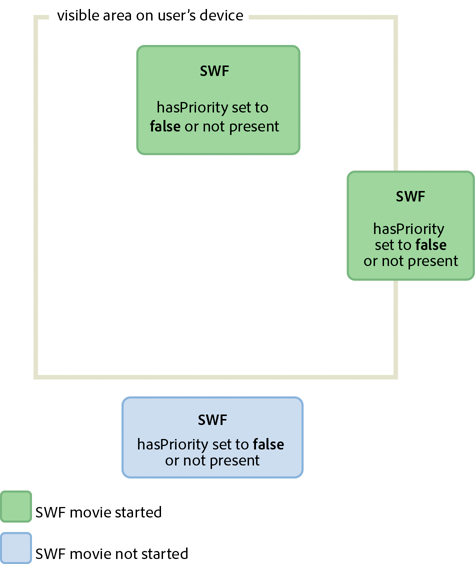
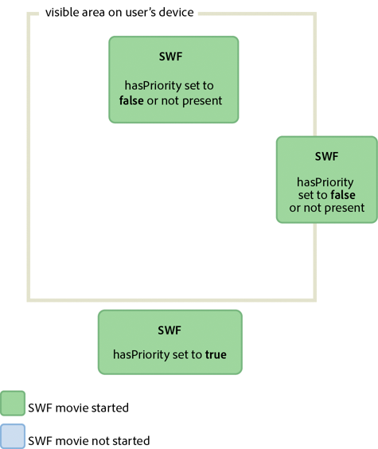
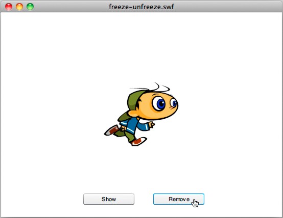

# Minimizing CPU usage

Another important area of focus for optimization is CPU usage. Optimizing CPU
processing improves performance, and as a result, battery life on mobile
devices.

## Flash Player 10.1 enhancements for CPU usage

Flash Player 10.1 introduces two new features that help save CPU processing. The
features involve pausing and resuming SWF content when it goes offscreen, and
limiting the number of Flash Player instances on a page.

### Pause, throttle, and resume

Note: The pause, throttle, and resume feature does not apply to Adobe® AIR®
applications. To optimize CPU and battery usage, Flash Player 10.1 introduces a
new feature on related to inactive instances. This feature allows you to limit
CPU usage by pausing and resuming the SWF file when content goes off and on the
screen. With this feature, Flash Player releases as much memory as possible by
removing any objects that can be recreated when the playing of content is
resumed. Content is considered offscreen when the entire content is offscreen.

Two scenarios cause the SWF content to be offscreen:

- The user scrolls the page and causes the SWF content to move offscreen.

  In this case, if there is any audio or video playback, content continues to
  play, but rendering is stopped. If there is no audio or video playing, to
  ensure that the playback or ActionScript execution is not paused, set the
  `hasPriority` HTML parameter to true. However, keep in mind that SWF content
  rendering is paused when content is offscreen or hidden, regardless of the
  value of the `hasPriority` HTML parameter.

- A tab is opened in the browser, which causes the SWF content to move to the
  background.

  In this case, regardless of the value of the `hasPriority` HTML tag, the SWF
  content is slowed down, or _throttled_ , to between 2 and 8 fps. Audio and
  video playback is stopped and no content rendering is processed unless the SWF
  content becomes visible again.

For Flash Player 11.2 and later running on Windows and Mac desktop browsers, you
can use the ThrottleEvent in your application. Flash Player dispatches a
ThrottleEvent when Flash Player pauses, throttles, or resumes play.

The ThrottleEvent is a broadcast event, which means that it is dispatched by all
EventDispatcher objects with a listener registered for this event. For more
information about broadcast events, see the
[DisplayObject](https://help.adobe.com/en_US/FlashPlatform/reference/actionscript/3/flash/display/DisplayObject.html)
class.

### Instance management

Note: The instance management feature does not apply to Adobe® AIR®
applications.

 Use the `hasPriority` HTML parameter to delay loading of
offscreen SWF files. Flash Player 10.1 introduces a new HTML parameter called
`hasPriority`:

    <param name="hasPriority" value="true" />

This feature limits the number of Flash Player instances that are started on a
page. Limiting the number of instances helps conserve CPU and battery resources.
The idea is to assign a specific priority to SWF content, giving some content
priority over other content on a page. Consider a simple example: a user is
browsing a website and the index page hosts three different SWF files. One of
them is visible, another one is partially visible onscreen, and the last one is
offscreen, requiring scrolling. The first two animations are started normally,
but the last one is deferred until it becomes visible. This scenario is the
default behavior when the `hasPriority` parameter is not present or set to
`false`. To ensure that a SWF file is started, even if it is offscreen, set the
`hasPriority` parameter to `true`. However, regardless of the value of the
`hasPriority` parameter, a SWF file that is not visible to the user always has
its rendering paused. Note: If available CPU resources become low, Flash Player
instances are no longer started automatically, even if the `hasPriority`
parameter is set to `true`. If new instances are created through JavaScript
after the page has been loaded, those instances will ignore the `hasPriority`
flag. Any 1x1 pixel or 0x0 pixel content is started, preventing helper SWF files
from being deferred if the webmaster fails to include the `hasPriority` flag.
SWF files can still be started when clicked, however. This behavior is called
“click to play.” The following diagrams show the effects of setting the
`hasPriority` parameter to different values:

Effects of different values for the hasPriority parameter

Effects of different values for the hasPriority parameter

## Sleep mode

Flash Player 10.1 and AIR 2.5 introduce a new feature on mobile devices that
helps save CPU processing, and as a result, battery life. This feature involves
the backlight found on many mobile devices. For example, if a user running a
mobile application is interrupted and stops using the device, the runtime
detects when the backlight goes into sleep mode. It then drops the frame rate to
4 frames per second (fps), and pauses rendering. For AIR applications, sleep
mode also begins when the application moves to the background.

ActionScript code continues to execute in sleep mode, similar to setting the
`Stage.frameRate` property to 4 fps. But the rendering step is skipped, so the
user cannot see that the player is running at 4 fps. A frame rate of 4 fps was
chosen, rather than zero, because it allows all the connections to remain open
(NetStream, Socket, and NetConnection). Switching to zero would break open
connections. A 250 ms refresh rate was chosen (4 fps) because many device
manufacturers use this frame rate as their refresh rate. Using this value keeps
the frame rate of the runtime in the same ballpark as the device itself. Note:
When the runtime is in sleep mode, the `Stage.frameRate` property returns the
frame rate of the original SWF file, rather than 4 fps. When the backlight goes
back into on mode, rendering is resumed. The frame rate returns to its original
value. Consider a media player application in which a user is playing music. If
the screen goes into sleep mode, the runtime responds based on the type of
content being played. Here is a list of situations with the corresponding
runtime behavior:

- The backlight goes into sleep mode and non-A/V content is playing: The
  rendering is paused and the frame rate is set to 4 fps.

- The backlight goes into sleep mode and A/V content is playing: the runtime
  forces the backlight to be always on, continuing the user experience.

- The backlight goes from sleep mode to on mode: the runtime sets the frame rate
  to the original SWF file frame rate setting and resumes rendering.

- Flash Player is paused while A/V content is played: Flash Player resets the
  backlight state to the default system behavior because A/V is no longer
  playing.

- Mobile device receives a phone call while A/V content is played: The rendering
  is paused and the frame rate is set to 4 fps.

- The backlight sleep mode is disabled on a mobile device: the runtime behaves
  normally.

When the backlight goes into sleep mode, rendering pauses and the frame rate
slows down. This feature saves CPU processing, but it cannot be relied upon on
to create a real pause, as in a game application. Note: No ActionScript event is
dispatched when the runtime enters or leaves sleep mode.

## Freezing and unfreezing objects

 Freeze and unfreeze objects properly by using the
`REMOVED_FROM_STAGE` and `ADDED_TO_STAGE` events. To optimize your code, always
freeze and unfreeze your objects. Freezing and unfreezing are important for all
objects, but are especially important for display objects. Even if display
objects are no longer in the display list and are waiting to be garbage
collected, they could still be using CPU-intensive code. For example, they can
still be using Event.ENTER_FRAME. As a result, it is critical to freeze and
unfreeze objects properly with the `Event.REMOVED_FROM_STAGE` and
`Event.ADDED_TO_STAGE` events. The following example shows a movie clip playing
on stage that interacts with the keyboard: // Listen to keyboard events
stage.addEventListener(KeyboardEvent.KEY_DOWN, keyIsDown);
stage.addEventListener(KeyboardEvent.KEY_UP, keyIsUp);   // Create object to
store key states var keys:Dictionary = new Dictionary(true);   function
keyIsDown(e:KeyboardEvent):void { // Remember that the key was pressed
keys[e.keyCode] = true;   if (e.keyCode==Keyboard.LEFT ||
e.keyCode==Keyboard.RIGHT) { runningBoy.play(); } }   function
keyIsUp(e:KeyboardEvent):void { // Remember that the key was released
keys[e.keyCode] = false;   for each (var value:Boolean in keys) if ( value )
return; runningBoy.stop(); }   runningBoy.addEventListener(Event.ENTER_FRAME,
handleMovement); runningBoy.stop();   var currentState:Number =
runningBoy.scaleX; var speed:Number = 15;   function
handleMovement(e:Event):void { if (keys[Keyboard.RIGHT]) { e.currentTarget.x +=
speed; e.currentTarget.scaleX = currentState; } else if (keys[Keyboard.LEFT]) {
e.currentTarget.x -= speed; e.currentTarget.scaleX = -currentState; } }
 Movie clip that interacts
with keyboard

When the Remove button is clicked, the movie clip is removed from the display
list:

    // Show or remove running boy
    showBtn.addEventListener (MouseEvent.CLICK,showIt);
    removeBtn.addEventListener (MouseEvent.CLICK,removeIt);

    function showIt (e:MouseEvent):void
    {
    addChild (runningBoy);
    }

    function removeIt(e:MouseEvent):void
    {
    if (contains(runningBoy)) removeChild(runningBoy);
    }

Even when removed from the display list, the movie clip still dispatches the
`Event.ENTER_FRAME` event. The movie clip still runs, but it is not rendered. To
handle this situation correctly, listen to the proper events and remove event
listeners, to prevent CPU-intensive code from being executed:

    // Listen to Event.ADDED_TO_STAGE and Event.REMOVED_FROM_STAGE
    runningBoy.addEventListener(Event.ADDED_TO_STAGE,activate);
    runningBoy.addEventListener(Event.REMOVED_FROM_STAGE,deactivate);

    function activate(e:Event):void
    {
    // Restart everything
    e.currentTarget.addEventListener(Event.ENTER_FRAME,handleMovement);
    }

    function deactivate(e:Event):void
    {
    // Freeze the running boy - consumes fewer CPU resources when not shown
    e.currentTarget.removeEventListener(Event.ENTER_FRAME,handleMovement);
    e.currentTarget.stop();
    }

When the Show button is pressed, the movie clip is restarted, it listens to
`Event.ENTER_FRAME` events again, and the keyboard correctly controls the movie
clip. Note: If a display object is removed from the display list, setting its
reference to `null` after removing it does not ensure that the object is frozen.
If the garbage collector doesn’t run, the object continues to consume memory and
CPU processing, even though the object is no longer displayed. To make sure that
the object consumes the least CPU processing possible, make sure that you
completely freeze it when removing it from the display list. Starting with Flash
Player 10 and AIR 1.5, the following behavior also occurs. If the playhead
encounters an empty frame, the display object is automatically frozen even if
you did not implement any freezing behavior.

The concept of freezing is also important when loading remote content with the
Loader class. When using the Loader class with Flash Player 9 and AIR 1.0, it
was necessary to manually freeze content by listening to the `Event.UNLOAD`
event dispatched by the LoaderInfo object. Every object had to be manually
frozen, which was a non-trivial task. Flash Player 10 and AIR 1.5 introduced an
important new method on the Loader class called `unloadAndStop()`. This method
allows you to unload a SWF file, automatically freeze every object in the loaded
SWF file, and force the garbage collector to run.

In the following code, the SWF file is loaded and then unloaded using the
`unload()` method, which requires more processing and manual freezing:

    var loader:Loader = new Loader();

    loader.load ( new URLRequest ( "content.swf" ) );

    addChild ( loader );

    stage.addEventListener ( MouseEvent.CLICK, unloadSWF );

    function unloadSWF ( e:MouseEvent ):void
    {
      // Unload the SWF file with no automatic object deactivation
      // All deactivation must be processed manually
      loader.unload();
    }

A best practice is to use the `unloadAndStop()` method, which handles the
freezing natively and forces the garbage collecting process to run:

    var loader:Loader = new Loader();

    loader.load ( new URLRequest ( "content.swf" ) );

    addChild ( loader );

    stage.addEventListener ( MouseEvent.CLICK, unloadSWF );

    function unloadSWF ( e:MouseEvent ):void
    {
      // Unload the SWF file with automatic object deactivation
      // All deactivation is handled automatically
      loader.unloadAndStop();
    }

The following actions occur when the `unloadAndStop()` method is called:

- Sounds are stopped.

- Listeners registered to the SWF file’s main timeline are removed.

- Timer objects are stopped.

- Hardware peripheral devices (such as camera and microphone) are released.

- Every movie clip is stopped.

- Dispatching of `Event.ENTER_FRAME`, `Event.FRAME_CONSTRUCTED`,
  `Event.EXIT_FRAME`, `Event.ACTIVATE` and `Event.DEACTIVATE` is stopped.

## Activate and deactivate events

 Use `Event.ACTIVATE` and `Event.DEACTIVATE` events to
detect background inactivity and optimize your application appropriately. Two
events ( `Event.ACTIVATE` and `Event.DEACTIVATE`) can assist you in fine-tuning
your application so that it uses the fewest CPU cycles possible. These events
allow you to detect when the runtime gains or loses focus. As a result, code can
be optimized to react to context changes. The following code listens to both
events and dynamically changes the frame rate to zero when the application loses
its focus. For example, the animation can lose focus when the user switches to
another tab or puts the application into the background:

    var originalFrameRate:uint = stage.frameRate;
    var standbyFrameRate:uint = 0;
     
    stage.addEventListener ( Event.ACTIVATE, onActivate );
    stage.addEventListener ( Event.DEACTIVATE, onDeactivate );
     
    function onActivate ( e:Event ):void
    {
    // restore original frame rate
    stage.frameRate = originalFrameRate;
    }
     
    function onDeactivate ( e:Event ):void
    {
    // set frame rate to 0
    stage.frameRate = standbyFrameRate;
    }

When the application gains focus again, the frame rate is reset to its original
value. Instead of changing the frame rate dynamically, you could also consider
making other optimizations, such as freezing and unfreezing objects.

The activate and deactivate events allow you to implement a similar mechanism to
the "Pause and Resume" feature sometimes found on mobile devices and Netbooks.

## Mouse interactions

 Consider disabling mouse interactions, when possible.
When using an interactive object, such as a MovieClip or Sprite object, the
runtime executes native code to detect and handle mouse interactions. Detecting
mouse interaction can be CPU-intensive when many interactive objects are shown
onscreen, especially if they overlap. An easy way to avoid this processing is to
disable mouse interactions on objects that do not require any mouse interaction.
The following code illustrates the use of the `mouseEnabled` and `mouseChildren`
properties:

    // Disable any mouse interaction with this InteractiveObject
    myInteractiveObject.mouseEnabled = false;
    const MAX_NUM:int = 10;
     
    // Create a container for the InteractiveObjects
    var container:Sprite = new Sprite();
     
    for ( var i:int = 0; i< MAX_NUM; i++ )
    {
    // Add InteractiveObject to the container
    container.addChild( new Sprite() );
    }
     
    // Disable any mouse interaction on all the children
    container.mouseChildren = false;

When possible, consider disabling mouse interaction, which helps your
application to use less CPU processing, and as a result, reduce battery usage on
mobile devices.

## Timers versus ENTER_FRAME events

 Choose either timers or `ENTER_FRAME` events, depending
on whether content is animated. Timers are preferred over `Event.ENTER_FRAME`
events for non-animated content that executes for a long time.

In ActionScript 3.0, there are two ways of calling a function at specific
intervals. The first approach is to use the `Event.ENTER_FRAME` event dispatched
by display objects (DisplayObject). The second approach is to use a timer.
ActionScript developers frequently use the `ENTER_FRAME` event approach. The
`ENTER_FRAME` event is dispatched on every frame. As a result, the interval at
which the function is called is related to the current frame rate. The frame
rate is accessible through the `Stage.frameRate` property. However, in some
cases, using a timer can be a better choice than using the `ENTER_FRAME` event.
For example, if you don’t use animation, but would like your code called at
specific intervals, using a timer can be a better choice.

A timer can behave in a similar way to an `ENTER_FRAME` event, but an event can
be dispatched without being tied to the frame rate. This behavior can offer some
significant optimization. Consider a video player application as an example. In
this case, you do not need to use a high frame rate, because only the
application controls are moving. Note: The frame rate does not affect the video,
because the video is not embedded in the timeline. Instead, the video is loaded
dynamically through progressive downloading or streaming. In this example, the
frame rate is set to a low value of 10 fps. The timer updates the controls at a
rate of one update per second. The higher update rate is made possible by the
`updateAfterEvent()` method, which is available on the TimerEvent object. This
method forces the screen to be updated each time the timer dispatches an event,
if needed. The following code illustrates the idea:

    // Use a low frame rate for the application
    stage.frameRate = 10;
     
    // Choose one update per second
    var updateInterval:int = 1000;
    var myTimer:Timer = new Timer(updateInterval,0);
     
    myTimer.start();
    myTimer.addEventListener( TimerEvent.TIMER, updateControls );
     
    function updateControls( e:TimerEvent ):void
    {
    // Update controls here
    // Force the controls to be updated on screen
    e.updateAfterEvent();
    }

Calling the `updateAfterEvent()` method does not modify the frame rate. It just
forces the runtime to update the content onscreen that has changed. The timeline
still runs at 10 fps. Remember that timers and `ENTER_FRAME` events are not
perfectly accurate on low performance devices, or if event handler functions
contain code that requires heavy processing. Just like the SWF file frame rate,
the update frame rate of the timer can vary in some situations.

 Minimize the number of Timer objects and registered
`enterFrame` handlers in your application. Each frame, the runtime dispatches an
`enterFrame` event to each display object in its display list. Although you can
register listeners for the `enterFrame` event with multiple display objects,
doing so means that more code is executed each frame. Instead, consider using a
single centralized `enterFrame` handler that executes all the code that is to
run each frame. By centralizing this code, it is easier to manage all the code
that is running frequently.

Likewise, if you’re using Timer objects, there is overhead associated with
creating and dispatching events from multiple Timer objects. If you must trigger
different operations at different intervals, here are some suggested
alternatives:

- Use a minimal number of Timer objects and group operations according to how
  frequently they happen.

  For example, use one Timer for frequent operations, set to trigger every 100
  milliseconds. Use another Timer for less-frequent or background operations,
  set to trigger every 2000 milliseconds.

- Use a single Timer object, and have operations triggered at multiples of the
  Timer object’s `delay` property interval.

  For example, suppose you have some operations that are expected to happen
  every 100 milliseconds, and others that you want to happen every 200
  milliseconds. In that case, use a single Timer object with a `delay` value of
  100 milliseconds. In the `timer` event handler, add a conditional statement
  that only runs the 200-millisecond operations every other time. The following
  example demonstrates this technique:

      var timer:Timer = new Timer(100);
      timer.addEventListener(TimerEvent.Timer, timerHandler);
      timer.start();

      var offCycle:Boolean = true;
       
      function timerHandler(event:TimerEvent):void
      {
      // Do things that happen every 100 ms

      if (!offCycle)
      {
          // Do things that happen every 200 ms
      }

      offCycle = !offCycle;
      }

 Stop Timer objects when not in use. If a Timer object’s
`timer` event handler only performs operations under certain conditions, call
the Timer object’s `stop()` method when none of the conditions are true.

 In `enterFrame` event or Timer handlers, minimize the
number of changes to the appearance of display objects that cause the screen to
be redrawn. Each frame, the rendering phase redraws the portion of the stage
that has changed during that frame. If the redraw region is large, or if it’s
small but contain a large quantity or complex display objects, the runtime needs
more time for rendering. To test the amount of redrawing required, use the “show
redraw regions” feature in the debug Flash Player or AIR.

For more information about improving performance for repeated actions, see the
following article:

- [Writing well-behaved, efficient, AIR applications](http://arno.org/arnotify/2009/05/writing-well-behaved-efficient-air-applications/)
  (article and sample application by Arno Gourdol)

## Tweening syndrome

 To save CPU power, limit the use of tweening, which
saves CPU processing, memory, and battery life. Designers and developers
producing content for Flash on the desktop tend to use many motion tweens in
their applications. When producing content for mobile devices with low
performance, try to minimize the use of motion tweens. Limiting their use helps
content run faster on low-tier devices.

More Help topics

[Application frame rate](./rendering-performance/application-frame-rate/index.md)

[Isolating behaviors](./rendering-performance/manual-bitmap-caching/isolating-behaviors.md)
