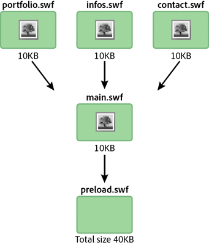
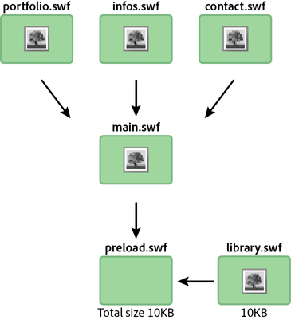

# External content

 Divide your application into multiple SWF files. Mobile
devices can have limited access to the network. To load your content quickly,
divide your application into multiple SWF files. Try to reuse code logic and
assets through the entire application. For example, consider an application that
has been divided into multiple SWF files, as shown in the following diagram:

Application divided into multiple SWF files

In this example, each SWF file contains its own copy of the same bitmap. This
duplication can be avoided by using a runtime shared library, as the following
diagram illustrates:

Using a runtime shared library

Using this technique, a runtime shared library is loaded to make the bitmap
available to the other SWF files. The ApplicationDomain class stores all class
definitions that have been loaded, and makes them available at runtime through
the `getDefinition()` method.

A runtime shared library can also contain all the code logic. The entire
application can be updated at runtime without recompiling. The following code
loads a runtime shared library and extracts the definition contained in the SWF
file at runtime. This technique can be used with fonts, bitmaps, sounds, or any
ActionScript class:

    // Create a Loader object
    var loader:Loader = new Loader();
     
    // Listen to the Event.COMPLETE event
    loader.contentLoaderInfo.addEventListener(Event.COMPLETE, loadingComplete );
     
    // Load the SWF file
    loader.load(new URLRequest("library.swf") );
    var classDefinition:String = "Logo";
     
    function loadingComplete(e:Event ):void
    {
    var objectLoaderInfo:LoaderInfo = LoaderInfo ( e.target );

    // Get a reference to the loaded SWF file application domain
    var appDomain:ApplicationDomain = objectLoaderInfo.applicationDomain;
     
    // Check whether the definition is available
    if ( appDomain.hasDefinition(classDefinition) )
    {
        // Extract definition
        var importLogo:Class = Class ( appDomain.getDefinition(classDefinition) );
     
        // Instantiate logo
        var instanceLogo:BitmapData = new importLogo(0,0);
     
        // Add it to the display list
        addChild ( new Bitmap ( instanceLogo ) );
    } else trace ("The class definition " +  classDefinition + " is not available.");
    }

Getting the definition can be made easier by loading the class definitions in
the loading SWF file’s application domain:

    // Create a Loader object
    var loader:Loader = new Loader();
     
    // Listen to the Event.COMPLETE event
    loader.contentLoaderInfo.addEventListener ( Event.COMPLETE, loadingComplete );
     
    // Load the SWF file
    loader.load ( new URLRequest ("rsl.swf"), new LoaderContext ( false, ApplicationDomain.currentDomain) );
    var classDefinition:String = "Logo";
     
    function loadingComplete ( e:Event ):void
    {
    var objectLoaderInfo:LoaderInfo = LoaderInfo ( e.target );

    // Get a reference to the current SWF file application domain
    var appDomain:ApplicationDomain = ApplicationDomain.currentDomain;
     
    // Check whether the definition is available
    if (appDomain.hasDefinition( classDefinition ) )
    {
        // Extract definition
        var importLogo:Class = Class ( appDomain.getDefinition(classDefinition) );
     
        // Instantiate it
        var instanceLogo:BitmapData = new importLogo(0,0);
     
        // Add it to the display list
        addChild ( new Bitmap ( instanceLogo ) );
    } else trace ("The class definition " +  classDefinition + " is not available.");
    }

Now the classes available in the loaded SWF file can be used by calling the
`getDefinition()` method on the current application domain. You can also access
the classes by calling the `getDefinitionByName()` method. This technique saves
bandwidth by loading fonts and large assets only once. Assets are never exported
in any other SWF files. The only limitation is that the application has to be
tested and run through the loader.swf file. This file loads the assets first,
and then loads the different SWF files that compose the application.
