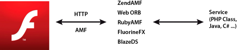

# Flash Remoting

>  Use Flash Remoting and AMF for optimized
> client-server data communication.

You can use XML to load remote content into SWF files. However, XML is plain
text that the runtime loads and parses. XML works best for applications that
load a limited amount of content. If you are developing an application that
loads a large amount of content, consider using the Flash Remoting technology
and Action Message Format (AMF).

AMF is a binary format used to share data between a server and the runtime.
Using AMF reduces the size of the data and improves the speed of transmission.
Because AMF is a native format for the runtime, sending AMF data to the runtime
avoids memory-intensive serialization and deserialization on the client side.
The remoting gateway handles these tasks. When sending an ActionScript data type
to a server, the remoting gateway handles the serialization for you on the
server side. The gateway also sends you the corresponding data type. This data
type is a class created on the server that exposes a set of methods that can be
called from the runtime. Flash Remoting gateways include ZendAMF, FluorineFX,
WebORB, and BlazeDS, an official open-source Java Flash Remoting gateway from
Adobe.

The following figure illustrates the concept of Flash Remoting:

Flash Remoting

The following example uses the NetConnection class to connect to a Flash
Remoting gateway:

    // Create the NetConnection object
    var connection:NetConnection = new NetConnection ();
     
    // Connect to a Flash Remoting gateway
    connection.connect ("http://www.example.com/remotingservice/gateway.php");
     
    // Asynchronous handlers for incoming data and errors
    function success ( incomingData:* ):void
    {
        trace( incomingData );
    }
     
    function error ( error:* ):void
    {
        trace( "Error occured" );
    }
     
    // Create an object that handles the mapping to success and error handlers
    var serverResult:Responder = new Responder (success, error);
     
    // Call the remote method
    connection.call ("org.yourserver.HelloWorld.sayHello", serverResult, "Hello there ?");

Connecting to a remoting gateway is straightforward. However, using Flash
Remoting can be made even easier by using the RemoteObject class included in the
Adobe® Flex® SDK.

> **Note:** External SWC files, such as the ones from the Flex framework, can be
> used inside an Adobe® Flash® Professional project. Using SWC files allows you
> to use the RemoteObject class and its dependencies without using the rest of
> the Flex SDK. Advanced developers can even communicate with a remoting gateway
> directly through the raw Socket class, if necessary.
