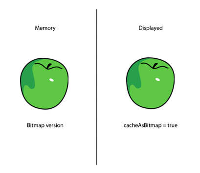
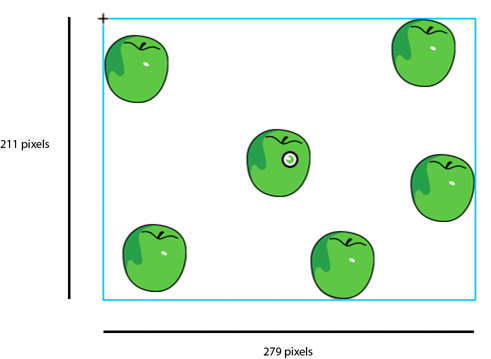
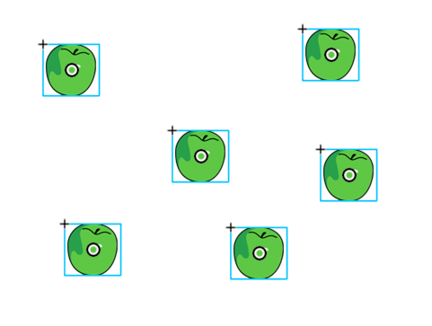
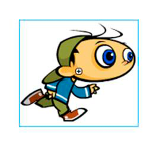
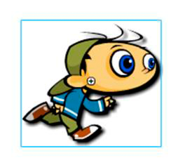

# Bitmap caching

>  Use the bitmap caching feature for complex vector
> content, when appropriate.

A good optimization can be made by using the bitmap caching feature. This
feature caches a vector object, renders it as a bitmap internally, and uses that
bitmap for rendering. The result can be a huge performance boost for rendering,
but it can require a significant amount of memory. Use the bitmap caching
feature for complex vector content, like complex gradients or text.

Turning on bitmap caching for an animated object that contains complex vector
graphics (such as text or gradients) improves performance. However, if bitmap
caching is enabled on a display object such as a movie clip that has its
timeline playing, you get the opposite result. On each frame, the runtime must
update the cached bitmap and then redraw it onscreen, which requires many CPU
cycles. The bitmap caching feature is an advantage only when the cached bitmap
can be generated once and then used without the need to update it.

If you turn on bitmap caching for a Sprite object, the object can be moved
without causing the runtime to regenerate the cached bitmap. Changing the `x`
and `y` properties of the object does not cause regeneration. However, any
attempt to rotate it, scale it, or change its alpha value causes the runtime to
regenerate the cached bitmap, and as a result, hurts performance.

> **Note:** The `DisplayObject.cacheAsBitmapMatrix` property available in AIR
> and the Packager for iPhone does not have this limitation. By using the
> `cacheAsBitmapMatrix` property, you can rotate, scale, skew, and change the
> alpha value of a display object without triggering bitmap regeneration.

A cached bitmap can use more memory than a regular movie clip instance. For
example, if the movie clip on the Stage is 250 x 250 pixels, when cached it uses
about 250 KB, instead of 1 KB uncached.

The following example involves a Sprite object that contains an image of an
apple. The following class is attached to the apple symbol:

    package org.bytearray.bitmap
    {
        import flash.display.Sprite;
        import flash.events.Event;

        public class Apple extends Sprite
        {
            private var destinationX:Number;
            private var destinationY:Number;

            public function Apple ()
            {
                addEventListener(Event.ADDED_TO_STAGE,activation);
                addEventListener(Event.REMOVED_FROM_STAGE,deactivation);
            }

            private function activation(e:Event):void
            {
                initPos();
                addEventListener (Event.ENTER_FRAME,handleMovement);
            }

            private function deactivation(e:Event):void
            {
                removeEventListener(Event.ENTER_FRAME,handleMovement);
            }

            private function initPos():void
            {
                destinationX = Math.random()*(stage.stageWidth - (width>>1));
                destinationY = Math.random()*(stage.stageHeight - (height>>1));
            }

            private function handleMovement(e:Event):void
            {
                x -= (x - destinationX)*.5;
                y -= (y - destinationY)*.5;

                if (Math.abs(x - destinationX) < 1 && Math.abs(y - destinationY) < 1)
                    initPos();
            }
        }
    }

The code uses the Sprite class instead of the MovieClip class, because a
timeline is not needed for each apple. For best performance, use the most
lightweight object possible. Next, the class is instantiated with the following
code:

    import org.bytearray.bitmap.Apple;

    stage.addEventListener(MouseEvent.CLICK,createApples);
    stage.addEventListener(KeyboardEvent.KEY_DOWN,cacheApples);

    const MAX_NUM:int = 100;
    var apple:Apple;
    var holder:Sprite = new Sprite();

    addChild(holder);

    function createApples(e:MouseEvent):void
    {
        for (var i:int = 0; i< MAX_NUM; i++)
        {
            apple = new Apple();

            holder.addChild(apple);
        }
    }

    function cacheApples(e:KeyboardEvent):void
    {
        if (e.keyCode == 67)
        {
            var lng:int = holder.numChildren;

            for (var i:int = 0; i < lng; i++)
            {
                apple = holder.getChildAt (i) as Apple;

                apple.cacheAsBitmap = Boolean(!apple.cacheAsBitmap);
            }
        }
    }

When the user clicks the mouse, the apples are created without caching. When the
user presses the C key (keycode 67), the apple vectors are cached as bitmaps and
shown onscreen. This technique greatly improves rendering performance, both on
the desktop and on mobile devices, when the CPU is slow.

However, although using the bitmap caching feature improves rendering
performance, it can quickly consume large amounts of memory. As soon as an
object is cached, its surface is captured as a transparent bitmap and stored in
memory, as shown in the following diagram:

Object and its surface bitmap stored in memory

Flash Player 10.1 and AIR 2.5 optimize the use of memory by taking the same
approach as described in the
[Filters and dynamic bitmap unloading](../../conserving-memory/filters-and-dynamic-bitmap-unloading.md).
If a cached display object is hidden or offscreen, its bitmap in memory is freed
when unused for a while.

> **Note:** If the display object's `opaqueBackground` property is set to a
> specific color, the runtime considers the display object to be opaque. When
> used with the `cacheAsBitmap` property, the runtime creates a non-transparent
> 32-bit bitmap in memory. The alpha channel is set to 0xFF, which improves
> performance, because no transparency is required to draw the bitmap onscreen.
> Avoiding alpha blending makes rendering even faster. If the current screen
> depth is limited to 16 bits, then the bitmap in memory is stored as a 16-bit
> image. Using the `opaqueBackground` property does not implicitly activate
> bitmap caching.

To save memory, use the `cacheAsBitmap` property and activate it on each display
object rather than on the container. Activating bitmap caching on the container
makes the final bitmap much larger in memory, creating a transparent bitmap with
dimensions of 211 x 279 pixels. The image uses around 229 KB of memory:

Activating bitmap caching on container

In addition, by caching the container, you risk having the whole bitmap updated
in memory, if any apple starts to move on a frame. Activating the bitmap caching
on the individual instances results in caching six 7-KB surfaces in memory,
which uses only 42 KB of memory:

Activating bitmap caching on instances

Accessing each apple instance through the display list and calling the
`getChildAt()` method stores references in a Vector object for easier access:

    import org.bytearray.bitmap.Apple;

    stage.addEventListener(KeyboardEvent.KEY_DOWN, cacheApples);

    const MAX_NUM:int = 200;
    var apple:Apple;
    var holder:Sprite = new Sprite();

    addChild(holder);

    var holderVector:Vector.<Apple> = new Vector.<Apple>(MAX_NUM, true);

    for (var i:int = 0; i< MAX_NUM; i++)
    {
        apple = new Apple();

        holder.addChild(apple);

        holderVector[i] = apple;
    }

    function cacheApples(e:KeyboardEvent):void
    {
        if (e.keyCode == 67)
        {
            var lng:int = holderVector.length

            for (var i:int = 0; i < lng; i++)
            {
                apple = holderVector[i];

                apple.cacheAsBitmap = Boolean(!apple.cacheAsBitmap);
            }
        }
    }

Keep in mind that bitmap caching improves rendering if the cached content is not
rotated, scaled, or changed on each frame. However, for any transformation other
than translation on the x- and y-axes, rendering is not improved. In these
cases, Flash Player updates the cached bitmap copy for every transformation
occurring on the display object. Updating the cached copy can result in high CPU
usage, slow performance, and high battery usage. Again, the
`cacheAsBitmapMatrix` property in AIR or the Packager for iPhone does not have
this limitation.

The following code changes the alpha value in the movement method, which changes
the opacity of the apple on every frame:

    private function handleMovement(e:Event):void
    {
        alpha = Math.random();
        x -= (x - destinationX)*.5;
        y -= (y - destinationY)*.5;

        if (Math.abs(x - destinationX) < 1 && Math.abs(y - destinationY) < 1)
            initPos();
    }

Using bitmap caching causes a performance slowdown. Changing the alpha value
forces the runtime to update the cached bitmap in memory whenever the alpha
value is modified.

Filters rely on bitmaps that are updated whenever the playhead of a cached movie
clip moves. So, using a filter automatically sets the `cacheAsBitmap` property
to `true`. The following figure illustrates an animated movie clip:

Animated movie clip

Avoid using filters on animated content, because it can cause performance
problems. In the following figure, the designer adds a drop shadow filter:

Animated movie clip with drop shadow filter

As a result, if the timeline inside the movie clip is playing, the bitmap must
be regenerated. The bitmap must also be regenerated if the content is modified
in any way other than a simple x or y transformation. Each frame forces the
runtime to redraw the bitmap, which requires more CPU resources, causes poor
performance, and consumes more battery life.

Paul Trani provides examples of using Flash Professional and ActionScript to
optimize graphics using bitmaps in the following training videos:

- [Cached bitmap transform matrixes in AIR](./cached-bitmap-transform-matrixes-in-air.md)
