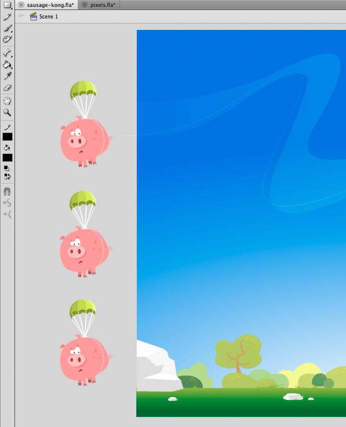

# Off-stage content

 Avoid placing content off-stage. Instead, just place
objects on the display list when needed. If possible, try not to place graphical
content off-stage. Designers and developers commonly place elements off-stage to
reuse assets during the lifetime of the application. The following figure
illustrates this common technique:

Off-stage content

Even if the off-stage elements are not shown onscreen and are not rendered, they
still exist on the display list. The runtime continues to run internal tests on
these elements to make sure that they are still off-stage and the user is not
interacting with them. As a result, as much as possible, avoid placing objects
off-stage and remove them from the display list instead.
