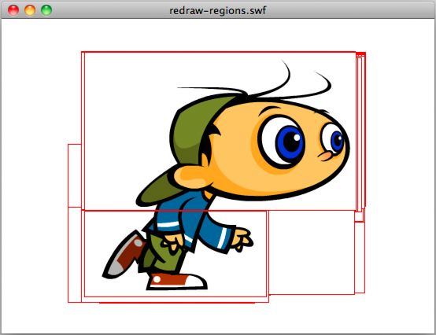
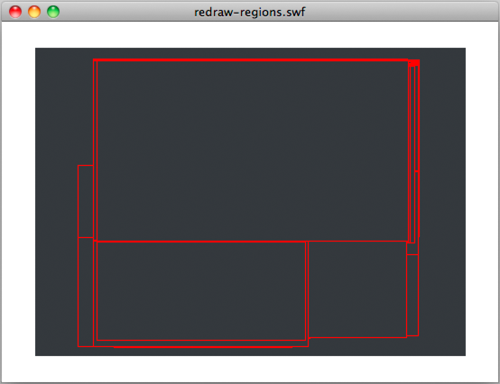

# Redraw regions

 Always use the redraw regions option when building your
project. To improve rendering, it's important to use the redraw regions option
when building your project. Using this option allows you to see the regions that
Flash Player is rendering and processing. You can enable this option by
selecting Show Redraw Regions in the context menu of the debug version of Flash
Player. Note: The Show Redraw Regions option is not available in Adobe AIR or in
the release version of Flash Player. (In Adobe AIR, the context menu is
available only in desktop applications, but it has no built-in or standard items
such as Show Redraw Regions.) The image below illustrates the option enabled
with a simple animated MovieClip on the timeline:

Redraw regions option enabled

You can also enable this option programmatically, by using the
`flash.profiler.showRedrawRegions()` method:

    // Enable Show Redraw Regions
    // Blue color is used to show redrawn regions
    flash.profiler.showRedrawRegions ( true, 0x0000FF );

In Adobe AIR applications, this method is the only way to enable the redraw
regions option.

Use redraw regions to identify opportunities for optimization. Remember that
although some display objects are not shown, they still consume CPU cycles
because they are still being rendered. The following image illustrates this
idea. A black vector shape covers the animated running character. The image
shows that the display object has not been removed from the display list and is
still being rendered. This wastes CPU cycles:

Redrawn regions

To improve performance, set the `visible` property of the hidden running
character to `false` or remove it from the display list altogether. You should
also stop its timeline. These steps ensure that the display object is frozen and
uses minimal CPU power.

Remember to use the redraw regions option during the whole development cycle.
Using this option prevents you from being surprised at the end of the project by
unnecessary redraw regions and optimization areas that have been missed.

More Help topics

[Freezing and unfreezing objects](../minimizing-cpu-usage.md#freezing-and-unfreezing-objects)
