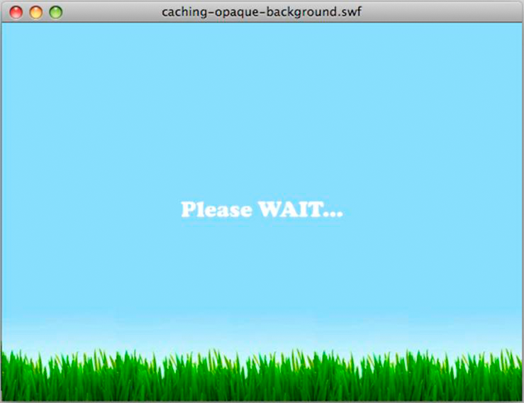
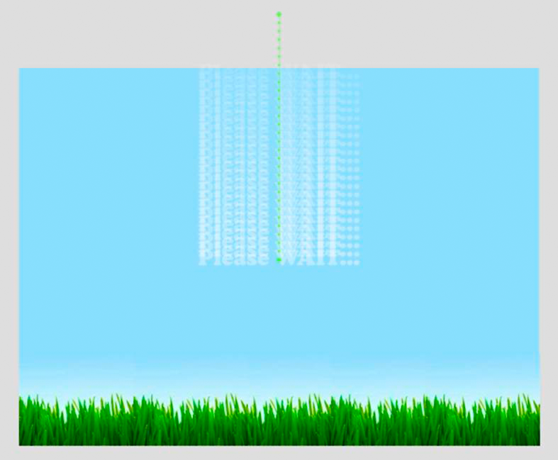

# Rendering text objects

 Use the bitmap caching feature and the
`opaqueBackground` property to improve text rendering performance. The Flash
Text Engine provides some great optimizations. However, numerous classes are
required to show a single line of text. For this reason, creating an editable
text field with the TextLine class requires a great deal of memory and many
lines of ActionScript code. The TextLine class is best used for static and
non-editable text, for which it renders faster and requires less memory.

The bitmap caching feature allows you to cache vector content as bitmaps to
improve rendering performance. This feature is helpful for complex vector
content and also when used with text content that requires processing to be
rendered.

The following example shows how the bitmap caching feature and the
`opaqueBackground` property can be used to improve rendering performance. The
following figure illustrates a typical Welcome screen that can be displayed when
a user is waiting for something to load:

Welcome screen

The following figure illustrates the easing that is applied to the TextField
object programmatically. The text eases slowly from the top of the scene to the
center of the scene:

Easing of text

The following code creates the easing. The `preloader` variable stores the
current target object to minimize property lookups, which can hurt performance:

    wait_mc.addEventListener( Event.ENTER_FRAME, movePosition );
     
    var destX:Number=stage.stageWidth/2;
    var destY:Number=stage.stageHeight/2;
    var preloader:DisplayObject;
     
    function movePosition( e:Event ):void
    {
    	preloader = e.currentTarget as DisplayObject;

    	preloader.x -= ( preloader.x - destX ) * .1;
    	preloader.y -= ( preloader.y - destY ) * .1;

    	if (Math.abs(preloader.y-destY)<1)
    		preloader.removeEventListener( Event.ENTER_FRAME, movePosition );
    }

The `Math.abs()` function could be moved inline here to reduce the number of
function calls and get more performance improvements. A best practice is to use
the int type for the `destX` and `destY` properties, so that you have
fixed-point values. Using the int type allows you to get perfect pixel snapping
without having to round values manually through slow methods like `Math.ceil()`
or `Math.round()`. This code doesn’t round the coordinates to int, because by
rounding the values constantly, the object does not move smoothly. The object
can have jittery movements, because the coordinates are snapped to the nearest
rounded integers on every frame. However, this technique can be useful when
setting a final position for a display object. Don’t use the following code:

    // Do not use this code
    var destX:Number = Math.round ( stage.stageWidth / 2 );
    var destY:Number = Math.round ( stage.stageHeight / 2);

The following code is much faster:

    var destX:int = stage.stageWidth / 2;
    var destY:int = stage.stageHeight / 2;

The previous code can be optimized even further, by using bitwise-shifting
operators to divide the values:

    var destX:int = stage.stageWidth >> 1;
    var destY:int = stage.stageHeight >> 1;

The bitmap caching feature makes it easier for the runtime to render objects by
using dynamic bitmaps. In the current example, the movie clip containing the
TextField object is cached:

    wait_mc.cacheAsBitmap = true;

One additional way to improve performance is by removing alpha transparency.
Alpha transparency places an additional burden on the runtime when drawing
transparent bitmap images, as in the previous code. You can use the
`opaqueBackground` property to bypass that, by specifying a color as a
background.

When using the `opaqueBackground` property, the bitmap surface created in memory
still uses 32 bits. However, the alpha offset is set to 255 and no transparency
is used. As a result, the `opaqueBackground` property does not reduce memory
usage, but it improves rendering performance when using the bitmap caching
feature. The following code contains all of the optimizations:

    wait_mc.addEventListener( Event.ENTER_FRAME, movePosition );
    wait_mc.cacheAsBitmap = true;
     
    // Set the background to the color of the scene background
    wait_mc.opaqueBackground = 0x8AD6FD;
    var destX:int = stage.stageWidth >> 1;
    var destY:int = stage.stageHeight >> 1;
    var preloader:DisplayObject;
     
    function movePosition ( e:Event ):void
    {
    	preloader = e.currentTarget as DisplayObject;

    	preloader.x -= ( preloader.x - destX ) * .1;
    	preloader.y -= ( preloader.y - destY ) * .1;

    	if ( Math.abs ( preloader.y - destY ) < 1 )
    		e.currentTarget.removeEventListener ( Event.ENTER_FRAME, movePosition );
    }

The animation is now optimized, and the bitmap caching has been optimized by
removing transparency. On mobile devices, consider switching the Stage quality
to `LOW` and `HIGH` during the different states of the animation while using the
bitmap caching feature:

    wait_mc.addEventListener( Event.ENTER_FRAME, movePosition );
    wait_mc.cacheAsBitmap = true;
    wait_mc.opaqueBackground = 0x8AD6FD;
     
    // Switch to low quality
    stage.quality = StageQuality.LOW;
    var destX:int = stage.stageWidth>>1;
    var destY:int = stage.stageHeight>>1;
    var preloader:DisplayObject;
     
    function movePosition( e:Event ):void
    {
    	preloader = e.currentTarget as DisplayObject;

    	preloader.x -= ( preloader.x - destX ) * .1;
    	preloader.y -= ( preloader.y - destY ) * .1;

    	if (Math.abs(e.currentTarget.y-destY)<1)
    	{
    		// Switch back to high quality
    		stage.quality = StageQuality.HIGH;
    		preloader.removeEventListener( Event.ENTER_FRAME, movePosition );
    	}
    }

However, in this case, changing the Stage quality forces the runtime to
regenerate the bitmap surface of the TextField object to match the current Stage
quality. For this reason, it is best to not change the Stage quality when using
the bitmap caching feature.

A manual bitmap caching approach could have been used here. To simulate the
`opaqueBackground` property, the movie clip can be drawn to a non-transparent
BitmapData object, which does not force the runtime to regenerate the bitmap
surface.

This technique works well for content that doesn’t change over time. However, if
the content of the text field can change, consider using a different strategy.
For example, imagine a text field that is continuously updated with a percentage
representing how much of the application has loaded. If the text field, or its
containing display object, has been cached as a bitmap, its surface must be
generated each time the content changes. You cannot use manual bitmap caching
here, because the display object content is constantly changing. This constant
change would force you to manually call the `BitmapData.draw()` method to update
the cached bitmap.

Remember that since Flash Player 8 (and AIR 1.0), regardless of the Stage
quality value, a text field with rendering set to Anti-Alias for Readability
remains perfectly anti-aliased. This approach consumes less memory, but it
requires more CPU processing and it renders a little more slowly than the bitmap
caching feature.

The following code uses this approach:

    wait_mc.addEventListener( Event.ENTER_FRAME, movePosition );
     
    // Switch to low quality
    stage.quality = StageQuality.LOW;
    var destX:int = stage.stageWidth >> 1;
    var destY:int = stage.stageHeight >> 1;
    var preloader:DisplayObject;
    function movePosition ( e:Event ):void
    {
    	preloader = e.currentTarget as DisplayObject;

    	preloader.x -= ( preloader.x - destX ) * .1;
    	preloader.y -= ( preloader.y - destY ) * .1;

    	if ( Math.abs ( preloader.y - destY ) < 1 )
    	{
    		// Switch back to high quality
    		stage.quality = StageQuality.HIGH;
    		preloader.removeEventListener ( Event.ENTER_FRAME, movePosition );
    	}
    }

Using this option (Anti-Alias for Readability) for text in motion is not
recommended. When scaling the text, this option causes the text tries to stay
aligned, which produces a shifting effect. However, if the display object’s
content is constantly changing and you need scaled text, you can improve
performance in mobile applications by setting the quality to `LOW`. When the
motion finishes, switch the quality back to `HIGH`.
