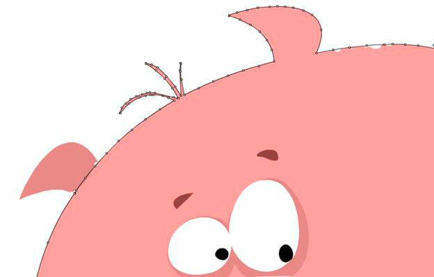

# Vector shape smoothing

 Smooth shapes to improve rendering performance. Unlike
bitmaps, rendering vector content requires many calculations, especially for
gradients and complex paths that contain many control points. As a designer or
developer, make sure that shapes are optimized enough. The following figure
illustrates non-simplified paths with many control points:

Non-optimized paths

By using the Smooth tool in Flash Professional, you can remove extra control
points. An equivalent tool is available in Adobe® Illustrator®, and the total
number of points and paths can be seen in the Document Info panel.

Smoothing removes extra control points, reducing the final size of the SWF file
and improving rendering performance. The next figure illustrates the same paths
after smoothing:

Optimized paths

As long as you do not oversimplify paths, this optimization does not change
anything visually. However, the average frame rate of your final application can
be greatly improved by simplifying complex paths.
